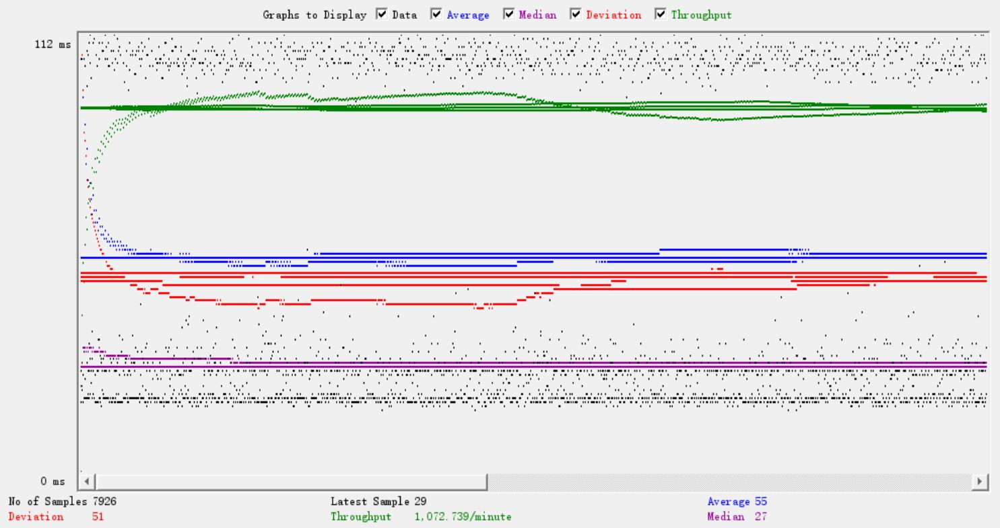
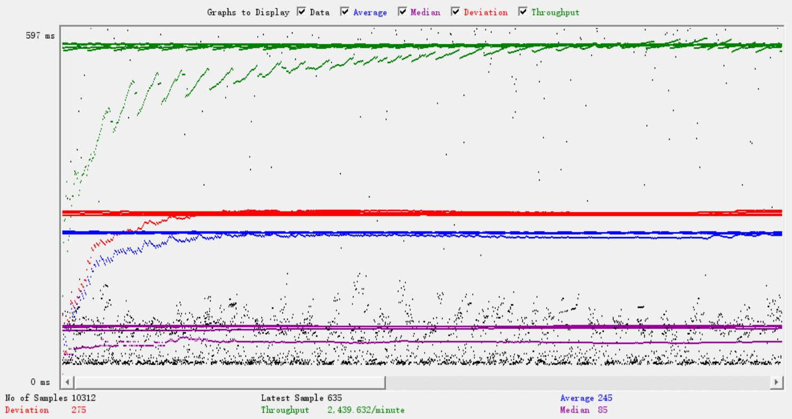
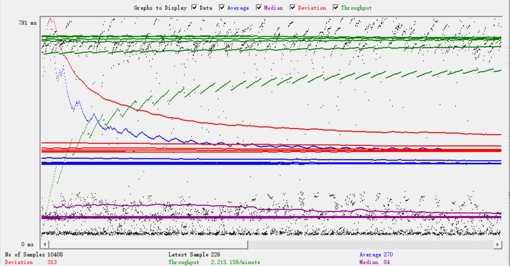
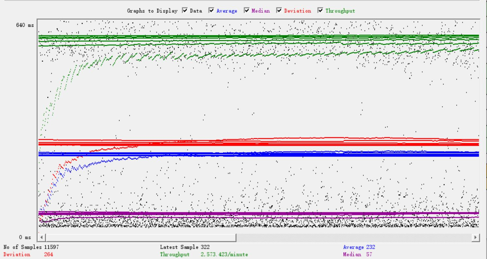
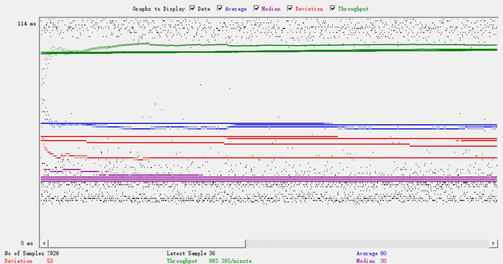
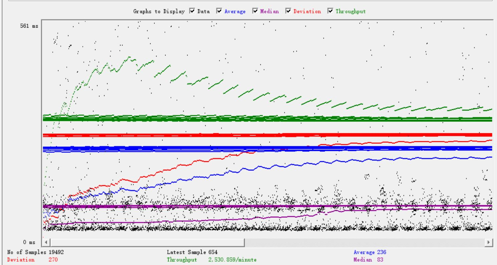
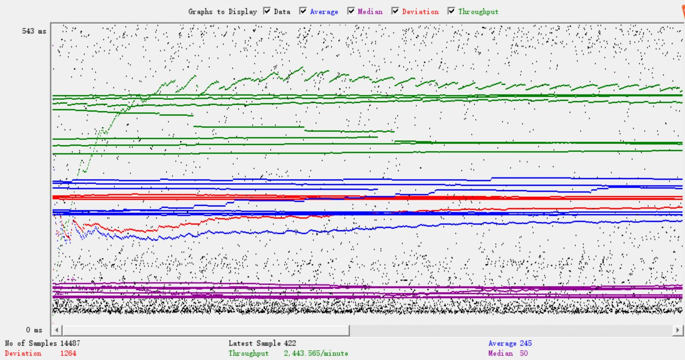

- # General
    - #### Team#:66
    
    - #### Names:Haodong Qi, Zixuan Chen
    
    - #### Project 5 Video Demo Link: https://youtu.be/6nbJo1KTOFI

    - #### Instruction of deployment:
    	- Project 4 (modified with connection pooling and used as the single instance server) and Project 5 folder needs to run under the Linux environment. If there is an exception thrown, please comment out the section of MainPageservlet where the program opens the file. 
    - #### Collaborations and Work Distribution:
	Haodong Qi is responsible for configuring connection pooling and load balancer and running the test cases. \
	Zixuan Chen is responsible for configuring master/slave replication, r/w routing, and designing the test plan.

    - #### Sidenote:
	1. Our measurement report is based on the original data(without xml parsing data).
	2. For our search feature we need to have a post request and a get request to complete the full cicyle.
	3. Recaptcha is disabled. You can login without going through recaptcha.
	4. Our single instance is using project4, its link path is /Fabflix0.4. (it is also mentioned in the demo video)
	5. Our master/slave instance using project5, its link path is /Fabflix. (it is also mentioned in the demo video)

- # Connection Pooling
    - #### Include the filename/path of all code/configuration files in GitHub of using JDBC Connection Pooling.
    	 [Config_single](../project4/webContent/META-INF/context.xml) / 
	 [Config_scaled](../project5/webContent/META-INF/context.xml)
    
    - #### Explain how Connection Pooling is utilized in the Fabflix code.
    	 Connection Pooling is enabled by adding parameters to the context configuration file. It helps the server performance by reusing idle connections instead of creating new ones.
    - #### Explain how Connection Pooling works with two backend SQL.
     	 There is one pool for each backend SQL server, created when the Tomcat server on each instance is deployed.
    
- # Master/Slave
    - #### Include the filename/path of all code/configuration files in GitHub of routing queries to Master/Slave SQL.
    	[Config_scaled](../project5/webContent/META-INF/context.xml)\
	[Routing code 1](../project5/src/main/java/DashboardServlet.java) / 
	[Routing code 2](../project5/src/main/java/PaymentServlet.java)

    - #### How read/write requests were routed to Master/Slave SQL?
    When a read request is sent to either master or slave, it will acess its local sql databases(located in resource file,  name="moviedb") to retrieve the information. \
    When a write request is sent to the master, it will write the data to its own databases(located in rescource file,  name="master"). \
    When a write request is sent to the slave, it will have a remote connection with the master and write one master sql database.
    

- # JMeter TS/TJ Time Logs
    - #### Instructions of how to use the `log_processing.*` script to process the JMeter logs.
	Give the two path of log file server time, and query time(jdbc time). It will return the time in millisecond

- # JMeter TS/TJ Time Measurement Report
	- Note: Our graph includes the login time, so it does not reflect the search time directly 

| **Single-instance Version Test Plan**          | **Graph Results Screenshot** | **Average Query Time(ms)** | **Average Search Servlet Time(ms)** | **Average JDBC Time(ms)** | **Analysis** |
|----------------------------------------------|---------------------------------|--------------------------------|----------------------------------------|-------------------------------|--------------|
| Case 1: HTTP/1 thread                                   |         |46ms                                         | 8.65ms                                                   |          8.10ms                           | There is not many pressure with only one user sending requests, so the server performed well                 |
| Case 2: HTTP/10 threads                               |         |109ms                                       | 63.72ms                                                 |         53.20ms                         | More Threads create much more workload for the server, so the performance dropped            |
| Case 3: HTTPS/10 threads                             |         | 106ms                                      | 61.28ms                                                 |          51.51ms                        | Small difference due to change of protocol or internet fluctuation. But performance is similar.           |
| Case 4: HTTP/10 threads/No connection pooling  |    | 101ms                               | 53.96ms                                                 |          20.08ms                        | Surprisingly, the server has a better performance without connection pooling. We think this is because we have a low throughput such that it is not enough to show the advantage of pooling. Instead, the overheads of managing the pooling lower the performance.     |

| **Scaled Version Test Plan**                   | **Graph Results Screenshot** | **Average Query Time(ms)** | **Average Search Servlet Time(ms)** | **Average JDBC Time(ms)** | **Analysis** |
|------------------------------------------|---------------------------------|----------------------------|-------------------------------------|---------------------------|--------------|
| Case 1: HTTP/1 thread                            |         | 53ms                                  | 9.31ms                                              |8.609ms                        | Compared to single-instance, the overhead of load balancing slightly lower the performance   |
| Case 2: HTTP/10 threads                        |         | 104ms                                | 57.10ms                                            |48.37ms                        |  With more Threads and load balancing, the server performed better          |
| Case 3: HTTP/10 threads/No connection pooling  |   | 105ms                    | 42.76ms                                          | 24.41ms                        | Likewise, the server performing better without pooling is likely caused by low throughput and overhead of poolings          |
